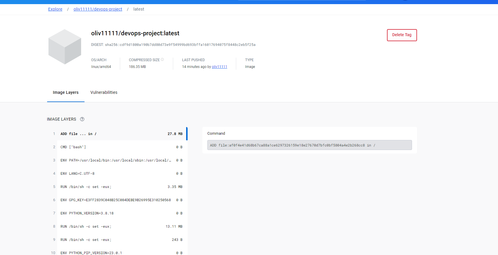

# Web APP DevOPs Project - AiCore

The first task was to fork and clone the existing application files. In the context of this project this is the existing code from the development repository that throughout this project I will transform into a much more scablable and effiecent development eco-system as the needs of this companies website and its development pipeline has scaled. 
I will be doing this by:
- Implementing better verison control through GIT 
- Containerisation using docker
- Infastructre as code (IaC) via terraform 
- Deployment and scalabilty improvements through kubernetes 
- CI/CD pipelines using Azure DevOps 
- Monitoring
- Azure Key Vault to keep sensitive infomation secure.

An architecture for the project is below:


## Application Context: 
The nature of the system we are providing these services to is an application that manages and monitors company deliveries, that allows users to view all orders easily and also add order information instantly with an 'add order' feature.


## Technology Stack

- **Backend:** Flask is used to build the backend of the application, handling routing, data processing, and interactions with the database.

- **Frontend:** The user interface is designed using HTML, CSS, and JavaScript to ensure a smooth and intuitive user experience.

- **Database:** The application employs an Azure SQL Database as its database system to store order-related data.

## Version Control
The first step is to clone the repository from github to my local machine so I can develop on my local machine and push, pull, merge and revert changes throughout development.
Some of the features that I will be using through the development of the project will be:
- Cloning: Allows devlopers to copy the entire repo onto their local machine
```bash
git clone <project-url>
```
- Push: Pushes any staged changes a developer has made to the repository for all other developers to see
```bash
git push
```
- Branching: Branching enables the isolation of work in progress, allowing developers to work on features or fixes without impacting the main codebase until ready. Creating a new branch is done using the following command
```bash
git checkout -b <new branch name>
```
- Revert:  Revert functionality provides the ability to undo changes made to the codebase, restoring it to a previous state if necessary. Reverting to a previousu version is done with the following command where the commit hash is the desired version you may wish to rollback to
```bash
git revert <commit hash>
```
- Pull Requests: Pull requests allow for collaboration and code review by proposing changes from a feature branch to the main branch for merging prior to actually merging branches. This is done in the GitHub web page


The **Delivery Date Column** feature aimed to provide additional information about the delivery process within the company's internal application. It introduced a new database column, `delivery_date`, to store and display delivery dates associated with orders.

## Docker (Contaierization)
Docker containerization significantly benefits the DevOps Project by providing portability, isolation, and reproducibility. Containers encapsulate the application and its dependencies, ensuring consistent performance across different environments. The lightweight nature of containers enhances resource efficiency and scalability, allowing for seamless deployment and easy horizontal scaling. Docker's versioning capability and centralized repository, Docker Hub, streamline collaboration and version control.

### How It Works - Docker Containerization Process

#### Step 1: Dockerfile Creation
Create a Dockerfile in the project root directory specifying the application's dependencies and configuration.

```Dockerfile
# TODO: Step 1 - Use an official Python runtime as a parent image
FROM python:3.8-slim

# TODO: Step 2 - Set the working directory in the container
WORKDIR /app

# TODO: Step 3 - Copy the application files into the container
COPY . /app

# TODO: Step 4 - Install Python packages specified in requirements.txt
RUN pip install --upgrade pip setuptools
RUN pip install -r requirements.txt

# TODO: Step 5 - Expose port
EXPOSE 5000

# TODO: Step 6 - Define Startup Command
CMD ["python", "app.py"]
```
#### Step 2: Building the Docker Image
```Bash
docker build -t devops-project:v1.0 .
```
#### Step 3: Tagging the Image
```Bash
docker tag devops-project:v1.0 oliv11111/devops-project:v1.0
```
#### Step 4: Pushing to Docker Hub
```Bash
docker push oliv11111/devops-project:v1.0
```
#### Step 5: Testing Push (Pulling from DockerHub)
```Bash
docker pull oliv11111/devops-project:v1.0
```
#### Step 6: Running Locally
```Bash
docker run -p 5000:5000 devops-project:v1.0
```
####  Step 7: Clean Up
```Bash
# Remove containers
docker ps -a
docker rm <container-id>
# Remove images
docker images -a
docker rmi <image-id>
```


## Infastructure as Code (IaC) - Terraform
When using Azure kubernetes services you can define the infastructre manually, however this can cause problems and is prone to errors and inconcistencies. Terraform allows me to automate these tasks efficiently. By treating infrastructure as code, Terraform promotes consistency, repeatability, and predictability in resource management. 

In the infastructure I am deploying I will create two terraform modules: 
Networking Module: This module is responsible for defining the networking infrastructure required b Azure Kubernetes Service (AKS) cluster. It typically includes resources such as virtual networks, subnets, network security groups, and possibly other components like Azure Firewall, load balancers, or application gateways. The networking module ensures that your AKS cluster has the necessary network resources to function securely and efficiently.

AKS Cluster Module: This module focuses on provisioning and configuring the AKS cluster itself. It includes resources such as the AKS cluster, node pools, Kubernetes versions, RBAC configurations, and other settings specific to the Kubernetes environment. The AKS cluster module abstracts away the complexities of creating and managing an AKS cluster, providing a simplified interface for deploying and managing Kubernetes clusters on Azure. 

### Azure Set Up
Before starting this step its important to note at this point I had to login to the azure CLI on the correct subscription so allow me to utlise these features. Then once logged in this was a good point to create a service principle to authenticate the terrafrom so I can access and have permissions with azure in the future
```bash
az login
azure set subscription
az ad sp create-for-rbac -n <service-principal-name> --role="Contributor" --scopes="/subscriptions/YOUR_SUBSCRIPTION_ID
```
Note: The reason I want to document this here is becasue in my devlopment I actually missed this step, which caused a heap of errors and headache down the line. So moving forward its always good practice to get the service principle created and stored somewhere so you don't have to run into any issues down the line
### How It Works - Defining Networking Module
#### Step 1: Create appropriate directories
These directories will house our terraform application. Our two modules in this project will be the networking and cluster module. The primairy focus for this milestone is initalising the newtorking module
```bash
mkdir aks-terraform
cd ask-terraform
mkdir networking-module
mkdir aks-cluster-module
```

#### Step 2: Create variables file 
This step was to create the variable.tf file. The variables.tf file in a Terraform project is used to define input variables. These variables act as parameters that allow users to customize the behavior of Terraform configurations without modifying the underlying code. By defining variables, you can create flexible and reusable Terraform modules that adapt to different environments, configurations, or user preferences.

The varibales defined were:
1. **resource_group_name**:
   - *Type*: string
   - *Default*: "networking_resource_group"
   - *Description*: Represents the name of the Azure Resource Group where networking resources will be deployed.

2. **location**:
   - *Type*: string
   - *Default*: "UK South"
   - *Description*: Specifies the Azure region where networking resources will be deployed.

3. **vnet_address_space**:
   - *Type*: list(string)
   - *Default*: ["10.0.0.0/16"]
   - *Description*: Specifies the address space for the Virtual Network (VNet) that will be created later in the main configuration file.


#### Step 3: Create main.tf file
The next step was the amin.tf file. Up to this point the main.tf file in our networking project is responsible for defining and provisioning essential networking resources for the cluster.  
The resources are as follows:  
1. **Azure Resource Group (Networking):**
   - **Name:** `resource_group_name`
  - **Purpose:** Represents an Azure Resource Group for grouping related networking resources.

2. **Azure Virtual Network (AKS-VNET):**
   - **Name:** `aks-vnet`
   - **Purpose:** Defines a Virtual Network for the Azure Kubernetes Service (AKS) cluster with the specified IP address space.

3. **Azure Subnet (Control Plane):**
   - **Name:** `control-plane-subnet`
   - **Purpose:** Represents the subnet for the AKS control plane, allocating IP addresses from the specified address range.

4. **Azure Subnet (Worker Node):**
   - **Name:** `worker-node-subnet`
   - **Purpose:** Represents the subnet for AKS worker nodes, allocating IP addresses from the specified range.

5. **Azure Network Security Group (AKS-NSG):**
   - **Name:** `aks-nsg`
   - **Purpose:** Defines a Network Security Group to control inbound and outbound traffic to the AKS cluster.

6. **Network Security Rule (kube-apiserver):**
   - **Name:** `kube-apiserver-rule`
   - **Purpose:** Allows inbound traffic on TCP port 443 to the kube-apiserver for AKS.

7. **Network Security Rule (SSH):**
   - **Name:** `ssh-rule`
   - **Purpose:** Allows inbound SSH traffic (TCP port 22) to the AKS cluster for administration purposes.

#### Step 4: 
The next step was to create the outputs.tf file. In this file a set of output variables are established to expose essential information about the networking resources, serving as valuable references for future configurations, providing easy access to crucial details about the infastructure.
The outputs are as follows:
1. **vnet_id**:
   - *Description*: ID of the Virtual Network (VNet).
   - *Value*: `azurerm_virtual_network.aks-vnet.id`

2. **control_plane_subnet_id**:
   - *Description*: ID of the control plane subnet.
   - *Value*: `azurerm_subnet.control-plane-subnet.id`

3. **worker_node_subnet_id**:
   - *Description*: ID of the worker node subnet.
   - *Value*: `azurerm_subnet.worker-node-subnet.id`

4. **resource_group_name**:
   - *Description*: Name of the Azure Resource Group for networking resources.
   - *Value*: `azurerm_resource_group.networking.id`

5. **aks_nsg_id**:
   - *Description*: ID of the Network Security Group (NSG) for AKS.
   - *Value*: `azurerm_network_security_group.aks-nsg.id`

#### Step 5: 
Now the essential files, variables, resources and outputs were created and defined it was time to initlaise the terraform project. To do this the following command is used.
```bash
terraform init
```
If done correctly a success message is displayed reading
```bash
oliv11111@LAPTOP-HM3O2P8O:~/aicore/Web-App-DevOps-Project/aks-terraform/networking-module$ terraform init

Initializing the backend...

Initializing provider plugins...
- Finding latest version of hashicorp/azurerm...
- Installing hashicorp/azurerm v3.89.0...
- Installed hashicorp/azurerm v3.89.0 (signed by HashiCorp)

Terraform has created a lock file .terraform.lock.hcl to record the provider
selections it made above. Include this file in your version control repository
so that Terraform can guarantee to make the same selections by default when
you run "terraform init" in the future.
```
#### Step 6: 
A quick step to check that the infastructure had been set up correctly is to run the terraform validate command. 
```bash
oliv11111@LAPTOP-HM3O2P8O:~/aicore/Web-App-DevOps-Project/aks-terraform/networking-module$ terraform validate
╷
│ Error: Unsupported attribute
│ 
│   on outputs.tf line 4, in output "vnet_id":
│    4:   value       = var.vnet_address_space.id
│     ├────────────────
│     │ var.vnet_address_space is a list of string
│ 
│ This value does not have any attributes.
╵
╷
│ Error: Reference to undeclared resource
│ 
│   on outputs.tf line 25, in output "aks_nsg_id":
│   25:   value       = azurerm_virtual_network.aks-nsg.id
│ 
│ A managed resource "azurerm_virtual_network" "aks-nsg" has not been declared in the root module.
╵
```
These were just simple syntax and variable name inconcistency errors which were cleaned up easily, however outline the importance of running this command.
#### Step 7:
Correct errors and re-run terraform init
```bash
terraform init
```
#### Step 8: 
The final step, pushing to git. Typically I would leave this out, however in this milestone an issue worth noting was experienced.

After adding, comming and pushing to the terraform branch I recieved the following error
```bash
oliv11111@LAPTOP-HM3O2P8O:~/aicore/Web-App-DevOps-Project$ git push --set-upstream origin terraform
Enumerating objects: 17, done.
Counting objects: 100% (17/17), done.
Delta compression using up to 8 threads
Compressing objects: 100% (9/9), done.
Writing objects: 100% (16/16), 53.97 MiB | 877.00 KiB/s, done.
Total 16 (delta 1), reused 0 (delta 0), pack-reused 0
remote: Resolving deltas: 100% (1/1), completed with 1 local object.
remote: error: Trace: d0e9df6ddec004d02e17ef94583cb7a49ac36c18215ab15e402b5e7814013a70
remote: error: See https://gh.io/lfs for more information.
remote: error: File aks-terraform/networking-module/.terraform/providers/registry.terraform.io/hashicorp/azurerm/3.89.0/linux_amd64/terraform-provider-azurerm_v3.89.0_x5 is 242.19 MB; this exceeds GitHub's file size limit of 100.00 MB
remote: error: GH001: Large files detected. You may want to try Git Large File Storage - https://git-lfs.github.com.
To https://github.com/oliv11111/Web-App-DevOps-Project.git
 ! [remote rejected] terraform -> terraform (pre-receive hook declined)
```
The issue was that I was trying to commit above the allowed file size when using git. After some invesitgation I discovered it was the 'aks-terraform/networking-module/.terraform/providers/registry.terraform.io/hashicorp/azurerm/3.89.0/linux_amd64/terraform-provider-azurerm_v3.89.0_x5' file. Which after researching isn't essential.

If I hadn't commited this file already I have added it to a .gitignore in the current branch, however it already was. So I created a new branch. Re-added the files and initalised the terraform project. Then before adding the changed, added the file path to the large file to .gitignore.

### How It Works - Defining Cluster Module
#### Step 1: Navigate to the appropriate Dir

#### Step 2: Create Variables File
Begin by creating the `variables.tf` file. This file serves to define input variables, allowing users to customize Terraform configurations without modifying the underlying code.

The variables defined are:

- **aks_cluster_name**:
  - *Type*: string
  - *Description*: Represents the name of the Azure Kubernetes Service (AKS) cluster.

- **cluster_location**:
  - *Type*: string
  - *Description*: Specifies the Azure region where the AKS cluster will be deployed.

- **dns_prefix**:
  - *Type*: string
  - *Description*: Defines the DNS prefix of the cluster.

- **kubernetes_version**:
  - *Type*: string
  - *Description*: Specifies the Kubernetes version for the AKS cluster.

- **service_principal_client_id**:
  - *Type*: string
  - *Description*: Represents the client ID for the service principal associated with the cluster.

- **service_principal_secret**:
  - *Type*: string
  - *Description*: Specifies the client secret for the service principal associated with the cluster.

  As well as some output variables from the networking module:
- **resource_group_name**
- **vnet_id**
- **control_plane_subnet_id**
- **worker_node_subnet_id**
- **aks_nsg_id**

#### Step 3: Create Main Configuration File
Now, create the `main.tf` file. This file is responsible for defining and provisioning the essential resources for the AKS cluster.

The resources included in this configuration are:

- **Azure Kubernetes Cluster (AKS)**:
  - **Name**: aks_cluster
  - **Purpose**: Defines the AKS cluster with specified configurations such as name, location, DNS prefix, and Kubernetes version.

  - **Default Node Pool**:
    - **Name**: default
    - **Node Count**: 1
    - **VM Size**: Standard_DS2_v2
    - **Auto Scaling**: Enabled
    - **Min Count**: 1
    - **Max Count**: 3

  - **Service Principal**:
    - **Client ID**: Specified by `service_principal_client_id`
    - **Client Secret**: Specified by `service_principal_secret`

#### Step 4: Define Outputs
The `outputs.tf` file is created to define output variables, exposing essential information about the AKS cluster for future configurations.

The outputs include:

- **aks_cluster_name**:
  - *Description*: Name of the AKS cluster.
  - *Value*: `azurerm_kubernetes_cluster.aks_cluster.name`

- **aks_cluster_id**:
  - *Description*: ID of the AKS cluster.
  - *Value*: `azurerm_kubernetes_cluster.aks_cluster.id`

- **aks_kubeconfig**:
  - *Description*: Kubeconfig for accessing the AKS cluster.
  - *Value*: `azurerm_kubernetes_cluster.aks_cluster.kube_config_raw`

#### Step 5: Initialize Terraform Project
Run the following command to initialize the Terraform project:

```bash
terraform init

oliv11111@LAPTOP-HM3O2P8O:~/aicore/Web-App-DevOps-Project/aks-terraform/aks-cluster-module$ terraform init

Initializing the backend...

Initializing provider plugins...
- Finding latest version of hashicorp/azurerm...
- Installing hashicorp/azurerm v3.89.0...
- Installed hashicorp/azurerm v3.89.0 (signed by HashiCorp)

Terraform has created a lock file .terraform.lock.hcl to record the provider
selections it made above. Include this file in your version control repository
so that Terraform can guarantee to make the same selections by default when
you run "terraform init" in the future.
```

### Root Terraform Initalisation/Creating the aks-cluster
Using the two modules create that have now been initalised the next step was to create and initalise the root terraform files, plan and apply. The root level terraform files tie together the provider set up and the module intergration. Meaning that the azure provider and any requirements are defined. And both the networking and aks-cluster modules are are configured with the correct input variables etc...

File Structure: 


#### Step 1: Create the main.tf 
Here we define all the values and versions as mentioned above:
```hcl
terraform {
  required_providers {
    azurerm = {
      source  = "hashicorp/azurerm"
      version = "=3.0.0"
    }
  }
}

provider "azurerm" {
    features {}
    client_id       = var.client_id
    client_secret   = var.client_secret
    subscription_id = "a0563489-aea6-4114-9eb6-e4a3ff177756"
    tenant_id       = "47d4542c-f112-47f4-92c7-a838d8a5e8ef"
    
}
```
The terraform block specifies the required provider and its version:
- required_providers: Specifies the required providers for this configuration.
- azurerm: Indicates the Azure provider.
- source: Specifies the source of the provider, in this case, "hashicorp/azurerm".
- version: Specifies the version of the provider required, "=3.0.0" in this example.

The provider "azurerm" block configures the Azure provider:
- features: An empty block indicating that no additional features are enabled.
- client_id: Specifies the client ID used for authenticating to Azure. It is usually provided as a variable (var.client_id).
- client_secret: Specifies the client secret used for authenticating to Azure. It is usually provided as a variable (var.client_secret).
subscription_id: Specifies the Azure subscription ID to use for provisioning resources.
- tenant_id: Specifies the Azure Active Directory tenant ID associated with the subscription.

The next block is the configure the networking module
```hcl
module "networking" {
  source = "./networking-module"

  # Input variables for the networking module
  resource_group_name   = "networking-reasource-group"
  location              = "UK South"
  vnet_address_space    = ["10.0.0.0/16"]
}
```
- 'source': Specifies the relative path to the directory containing the networking module.
- Input variables:
    - resource_group_name: Specifies the name of the Azure Resource Group for networking resources.
    - location: Specifies the Azure region where networking resources will be deployed (e.g., "UK South").
    - vnet_address_space: Specifies the address space for the Virtual Network (VNet) as a list of CIDR blocks.

The final block is the cluster module
```hcl
module "aks_cluster" {
  source = "./aks-cluster-module"

  # Input variables for the AKS cluster module
  aks_cluster_name              = "terraform-aks-cluster"
  cluster_location              = "UK South"
  dns_prefix                    = "myaks-project"
  kubernetes_version            = "1.26.6"  # Adjust the version as needed
  service_principal_client_id   = var.client_id 
  service_principal_secret      = var.client_secret

  # Input variables referencing outputs from the networking module
  resource_group_name         = module.networking.resource_group_name
  vnet_id                     = module.networking.vnet_id
  control_plane_subnet_id     = module.networking.control_plane_subnet_id
  worker_node_subnet_id       = module.networking.worker_node_subnet_id
  aks_nsg_id                  = module.networking.aks_nsg_id
}
```
- `source`: Specifies the relative path to the directory containing the AKS cluster module.
- Input variables:
  - `aks_cluster_name`: Specifies the name of the Azure Kubernetes Service (AKS) cluster.
  - `cluster_location`: Specifies the Azure region where the AKS cluster will be deployed.
  - `dns_prefix`: Specifies the DNS prefix of the AKS cluster.
  - `kubernetes_version`: Specifies the version of Kubernetes for the AKS cluster.
  - `service_principal_client_id`: Specifies the client ID for the service principal associated with the AKS cluster.
  - `service_principal_secret`: Specifies the client secret for the service principal associated with the AKS cluster.
- Input variables referencing outputs from the networking module:
  - `resource_group_name`: Retrieves the name of the Azure Resource Group from the networking module.
  - `vnet_id`: Retrieves the ID of the Virtual Network (VNet) from the networking module.
  - `control_plane_subnet_id`: Retrieves the ID of the control plane subnet from the networking module.
  - `worker_node_subnet_id`: Retrieves the ID of the worker node subnet from the networking module.
  - `aks_nsg_id`: Retrieves the ID of the Network Security Group (NSG) for AKS from the networking module.

#### Step 2: Create varibales.tf file:
  This file is for storing any 'var.' referenced in the main.tf 
```hcl
variable "client_id" {
description = "Access key for the provider"
type        = string
sensitive   = true
}

variable "client_secret" {
description = "Secret key for the provider"
type        = string
sensitive   = true
}
```
What you will notice here is that typically the values would also be defined here, however as the values we want store are of a sensitive nature we used a secrets.tfvars file to store the actual values.

secrets.tfvars is a file used in Terraform to store sensitive information such as API keys, passwords, or other credentials required by your infrastructure deployment. It allows you to separate sensitive data from your main Terraform configuration files, enhancing security by preventing sensitive information from being exposed in plain text. In our case we are storing the values of our serivce principle client_id and client_secret. We can still reference these values the same as if they were also stored in the variables file.

Note: Its important to remember to add this file to .gitignore otherwise it will still be pushed to the repo

#### Step 3: Initalise
```bash
terraform init
```

#### Step 4: Plan
Now our code is set up it is time to run plan. Terraform plan is a Terraform command that compares your infrastructure's current state to the desired state defined in your configuration files. It outlines the actions needed to achieve the desired state, such as creating, updating, or deleting resources. This command provides a preview of changes without actually applying them, helping you understand the impact of your configuration changes before execution.
```bash
terraform plan
```
Once this returns with a succesful plan we can now apply
#### Step 5: Apply
Terraform apply is a Terraform command used to apply the changes defined in your Terraform configuration files to your infrastructure. It reads the configuration, creates, updates, or deletes resources as necessary to match the desired state, and records the changes in Terraform state files. This command executes the changes defined in your configuration, making them effective in your infrastructure.
```bash
terraform apply
```
#### Step 6: Accesing the cluster/validation of correct infastructre
Now we have applied the infastructre the aks-cluster has now been created and can be validated by checking in the azure portal


## Deployment
Deployments are used to define the desired state for your application, including the number of replicas (Pods) and the Docker image to use. we do this in a .yaml file

#### Step 1: Create application-manifest.yaml - Kubernetes Deployment
```yaml
apiVersion: apps/v1
kind: Deployment
metadata:
  name: flask-app-deployment
spec: 
  replicas: 2 
  selector:
    matchLabels:
      app: flask-app 
  template:
    metadata:
      labels:
        app: flask-app 
    spec:
      containers:
      - name: flask-app-container
        image: "oliv11111/devops-project:v1.0" 
        ports:
        - containerPort: 5000 
  strategy:
    type: RollingUpdate
    rollingUpdate:
      maxUnavailable: 1
      maxSurge: 1

```

In this code we:
- define a deployment named flask-app-deployment to oversee the containerized application. Set the replica count to two, ensuring scalability and fault tolerance within the AKS cluster.
- In the selector field, use the matchLabels section to assign a unique label to your application, such as app: flask-app. This label enables Kubernetes to identify the pods managed by the Deployment accurately.
- Within the metadata section, label the pod template with app: flask-app. This label establishes a clear link between the pods and the managed application.
Specify the container image's location on Docker Hub to ensure the correct image is used for deployment.
- Expose port 5000 for intra-cluster communication, serving as the entry point for accessing the application's interface.
- Implement the Rolling Updates deployment strategy, enabling seamless application updates. This strategy ensures that only one pod is updated at a time, with one pod temporarily unavailable, thus maintaining application availability.

#### Step 2: Expose Application
The following blocknin the .yaml file exposes the application for internal access within the cluster
```yaml
apiVersion: v1
kind: Service
metadata:
  name: flask-app-service
spec:
  selector:
    app: flask-app
  ports:
    - protocol: TCP
      port: 80
      targetPort: 5000
  type: ClusterIP
```
This service is configured to direct traffic to Pods labeled with app: nginx. When services within the cluster want to communicate with this application.

#### Step 3: Deploy
Now the .yaml file is complete we can now apply it to the AKS cluster. 
```bash
kubectl apply -f application-manifest.yaml
```
#### Step 4: Test
To test this has worked we can run a command to view the pods and their health
```bash
kubectl get pods

#Output displaying the healthy and running pods
NAME                                    READY   STATUS    RESTARTS   AGE
flask-app-deployment-755759445c-2qrcv   1/1     Running   0          47h
flask-app-deployment-755759445c-phcjg   1/1     Running   0          47h
```
#### Step 5: Port Forward
To further test this has worked as expected I then port forwarded to run the applicaiton locally
```bash
kubectl port-forward deployment/flask-app-deployment 5000:5000
```
If run correctly the application is now accessible at: http://127.0.0.1:5000 

## CI/CD Pipeline
The next step was to build the appropriate pipelines for the build and deployment of the applicaiton. For these pipelines I used AzureDevops Interface.

- The build pipeline consists of multiple components that work together to automate the build and testing process.

- The release pipeline are the bridge between your application development and its deployment to different environments. They are a series of automated steps and processes designed to facilitate the seamless deployment of your application to different target environments.

#### Step 1: Create Project and Connect Repo
This first step is quite self explanitory and requires signing into the Azure DevOps portal, creating a project and then following the onscreen instructuions to connect the project to the correct github repo.


#### Step 2: Connect to docker hub
Before building the pipeline it is a good practice to create the service to my docker hub. This again is done following the portal instructions and also generating a unique key from docker hub to validate your access.

#### Step 3: Build Pipeline
```yml
steps:
- task: Docker@2
  inputs:
    containerRegistry: 'Docker Hub'
    repository: 'oliv11111/devops-project'
    command: 'buildAndPush'
    Dockerfile: '**/Dockerfile'
    tags: 'latest'
```

- Docker@2: Indicates that the task is using the Docker task provided by Azure Pipelines. The @2 signifies the version of the Docker task being used.

- inputs: Specifies the inputs or parameters required for the Docker task.

- containerRegistry: Specifies the Docker registry where the image will be pushed. In this case, it's set to 'Docker Hub'.

- repository: Specifies the repository in the Docker registry where the image will be stored. Here, it's 'oliv11111/devops-project'.

- command: Defines the action to be performed by Docker. In this case, it's 'buildAndPush', which means building the Docker image and pushing it to the registry.

- Dockerfile: Specifies the path to the Dockerfile used for building the image. The **/Dockerfile pattern indicates that the Dockerfile can be located in any subdirectory within the repository.

- tags: Specifies the tags to be applied to the Docker image. Here, it's set to 'latest', indicating that the image will be tagged as 'latest'.

#### Step 4: Release Pipeline
```yml
- task: KubernetesManifest@1
  displayName: "Start container on Azure Kubernetes Cluster (AKS)"
  inputs:
    action: "deploy"
    connectionType: "azureResourceManager"
    azureSubscriptionConnection: "aks-cluster"
    azureResourceGroup: "resource_group_name"
    kubernetesCluster: "terraform-aks-cluster"
    manifests: "application-manifest.yaml"
``` 
- KubernetesManifest@1: Indicates that the task is using the Kubernetes Manifest task provided by Azure DevOps. The @1 signifies the version of the task being used.

- displayName: Provides a human-readable name for the task to be displayed in the pipeline's execution logs or UI.

- inputs: Specifies the inputs or parameters required for the Kubernetes Manifest task.

- action: Defines the action to be performed on the Kubernetes cluster. Here, it's set to "deploy", indicating that the task will deploy the specified manifests to the Kubernetes cluster.

- connectionType: Specifies the type of connection to be used for interacting with Azure resources. In this case, it's set to "azureResourceManager" for Azure Resource Manager.

- azureSubscriptionConnection: Specifies the Azure subscription connection to be used. Here, it's set to "aks-cluster", indicating the connection to the Azure Kubernetes Service (AKS) cluster.

- azureResourceGroup: Specifies the Azure resource group where the Kubernetes cluster is located. The value is set to "resource_group_name".

- kubernetesCluster: Specifies the name of the Kubernetes cluster where the manifests will be deployed. Here, it's set to "terraform-aks-cluster".

- manifests: Specifies the path to the Kubernetes manifest file or files that define the resources to be deployed to the cluster. In this case, it's set to "application-manifest.yaml".


#### Step 5: Testing
Again we can test this has worked by getting the pods and running the application locally by port forwarding

```yml
olive@LAPTOP-HM3O2P8O MINGW64 ~/OneDrive/Desktop/Web-App-DevOps-Project (main)
$ kubectl port-forward deployment/flask-app-deployment 5000:5000
Forwarding from 127.0.0.1:5000 -> 5000
Forwarding from [::1]:5000 -> 5000
Handling connection for 5000
Handling connection for 5000
Handling connection for 5000

olive@LAPTOP-HM3O2P8O MINGW64 ~/OneDrive/Desktop/Web-App-DevOps-Project (main)
$ kubectl get pods
NAME                                    READY   STATUS    RESTARTS   AGE
flask-app-deployment-755759445c-2qrcv   1/1     Running   0          47h
flask-app-deployment-755759445c-phcjg   1/1     Running   0          47h
```

## Monitoring and Alerts
Average Node CPU Usage:
- Significance: Tracks the CPU usage across all nodes in the AKS cluster.
- Interpretation: Helps in identifying nodes with high CPU usage which could indicate a need for scaling or optimization.


Average Pod Count:
- Significance: Shows the average number of pods running in the cluster.
- Interpretation: Useful for understanding the cluster's workload and capacity utilization.


Used Disk Percentage:
- Significance: Indicates the percentage of disk space utilized.
- Interpretation: Critical for preventing storage-related issues by proactive monitoring.


Bytes Read and Written per Second:
- Significance: Provides insights into the data transfer rates in and out of storage devices.
- Interpretation: Aids in identifying potential I/O bottlenecks.


I also set up a series of alerts to notify my email when certiain limits are exceeed on the CPU, Memory or Diskm Via a crital alert action group.


!

## AKS Vault

AKS Vault is a tool designed to integrate Azure Kubernetes Service (AKS) clusters with HashiCorp Vault, a secrets management solution. It helps in securely managing sensitive information such as API keys, passwords, and certificates within AKS clusters by leveraging the capabilities of Vault. AKS Vault facilitates the dynamic generation, storage, and retrieval of secrets, ensuring that applications running on AKS can securely access the required credentials without exposing them directly in code or configuration files. And it is what I will be using to store senestive variables for the application. 

The variables I am protecting from app.py are:
- server
- database
- username 
- password  

#### Step 1: Create AKS Vault
To do this I just used the azure portal, navigated to the reasource group in which i want the vault to exist and created it following the on screen instructions
#### Step 2: Create secrets
Within the vault, I then created 4 new secrets, for the variables I want to keep secure:
- server
- database
- username 
- password 


#### Step 3: Set Cluster to managed identity
To make my cluster a managed identity to be able to interact with the vault i ran the following command:
```bash
az aks update --resource-group resource_group_name --name terraform-aks-cluster --enable-managed-identity
```
#### Step 4: Assign RBAC role to aks cluster:
To then give the cluster permissions to access these secrets i ran the following command
```bash
olive@LAPTOP-HM3O2P8O MINGW64 ~/OneDrive/Desktop/Web-App-DevOps-Project (main)
$ az role assignment create --role "Key Vault Secrets Officer" --assignee 5963d3f3-b43b-4bac-863a-290c7f36e18a --scope subscriptions/a0563489-aea6-4114-9eb6-e4a3ff177756/resourceGroups/resource_group_name/provi
ders/Microsoft.KeyVault/vaults/OliverUnasingAKSVault
{
  "condition": null,
  "conditionVersion": null,
  "createdBy": null,
  "createdOn": "2024-02-11T21:45:57.207351+00:00",
  "delegatedManagedIdentityResourceId": null,
  "description": null,
  "id": "/subscriptions/a0563489-aea6-4114-9eb6-e4a3ff177756/resourceGroups/resource_group_name/providers/Microsoft.KeyVault/vaults/OliverUnasingAKSVault/providers/Microsoft.Authorization/roleAssignments/ec211a14-198f-427e-ba32-a8811b94313b",
  "name": "ec211a14-198f-427e-ba32-a8811b94313b",
  "principalId": "de59c685-e483-4216-bf53-8494b914fab8",
  "principalType": "ServicePrincipal",
  "resourceGroup": "resource_group_name",
  "roleDefinitionId": "/subscriptions/a0563489-aea6-4114-9eb6-e4a3ff177756/providers/Microsoft.Authorization/roleDefinitions/b86a8fe4-44ce-4948-aee5-eccb2c155cd7",
  "scope": "/subscriptions/a0563489-aea6-4114-9eb6-e4a3ff177756/resourceGroups/resource_group_name/providers/Microsoft.KeyVault/vaults/OliverUnasingAKSVault",
  "type": "Microsoft.Authorization/roleAssignments",
  "updatedBy": "43a08f55-27e4-4079-b5f0-0cf7c0f6c9e5",
  "updatedOn": "2024-02-11T21:45:57.442804+00:00"
}

```

#### Step 5: Accessing the values in app.py
To then reference these values in the application code first installed necessary libraries 
```bash
pip install azure-identity
pip install azure-keyvault-secrets
```

Then updates the app.py file
```python
key_vault_name = 'OliverUnasingAKSVault'
key_vault_url = f"https://{key_vault_name}.vault.azure.net"

# Set up Azure Key Vault client with Managed Identity
credential = ManagedIdentityCredential()
secret_client = SecretClient(vault_url=key_vault_url, credential=credential)

# Access the secret values from Key Vault
secret_name1 = "database-name"
secret1 = secret_client.get_secret(secret_name1)

secret_name2 = "server-name"
secret2 = secret_client.get_secret(secret_name2)

secret_name3 = "server-password"
secret3 = secret_client.get_secret(secret_name3)

secret_name4 = "server-username"
secret4 = secret_client.get_secret(secret_name4)
```
#### Step 6: 
To test this has worked I pushed the code to trigger the build pipeline and ran the two commands we have previously used to test
```bash
olive@LAPTOP-HM3O2P8O MINGW64 ~/OneDrive/Desktop/Web-App-DevOps-Project (main)
$ kubectl port-forward deployment/flask-app-deployment 5000:5000
Forwarding from 127.0.0.1:5000 -> 5000
Forwarding from [::1]:5000 -> 5000
Handling connection for 5000
Handling connection for 5000
Handling connection for 5000

olive@LAPTOP-HM3O2P8O MINGW64 ~/OneDrive/Desktop/Web-App-DevOps-Project (main)
$ kubectl get pods
NAME                                    READY   STATUS    RESTARTS   AGE
flask-app-deployment-755759445c-2qrcv   1/1     Running   0          47h
flask-app-deployment-755759445c-phcjg   1/1     Running   0          47h
```

## Testing

To test the system one final time i port forwarded to run the application locally and did a full inspection of the system. 

1. First testing the viewing and pagenation of the app worked


<span style="color:green">SUCCESS</span>

2. Creating a new Order


<span style="color:green">SUCCESS</span>

3. Viewing new order in table


<span style="color:green">SUCCESS</span>

After this comprehnsive testing of the system I concluded the project complete.


## Key Takeaways
First of all this project was extremely rewarding upon completion and has given me a great insight into the DevOps engieering process and pipeline. I did encounter some errors/learn some lessons along the way.

- First of all for half of my development I was using WSL, the reason for this was because initally i found it much easier to install libs and software on linux, however when needing to run resource intensive commands my system became very (emphasis on very) slow. Therefore I switched back to windows. So going forward I will keep the nature of the task in mind when devloping
- The second key takeaway from this project is despite how tricky to figure out, how useful terraform actually is and how it makes setting up infastructre so much more consistent when doing it as code (IaC)
- The third and final takeaway for me is to always be aware of simple things such as making sure the enviroment is set up correctly, i am logged into the correct accounts and using the correct subscriptions. Too many times I had errors and set backs where i simply was in the wrong context or hadnt linked my account or subscription correctly

Overall this was a great project and want to shout out aicore stagg who helped me along the way.


## License

This project is licensed under the MIT License. For more details, refer to the [LICENSE](LICENSE) file.

## Contributors 

- [Maya Iuga]([https://github.com/yourusername](https://github.com/maya-a-iuga))
- [Oliver Unasing]([https://github.com/yourusername](https://github.com/oliv11111))
